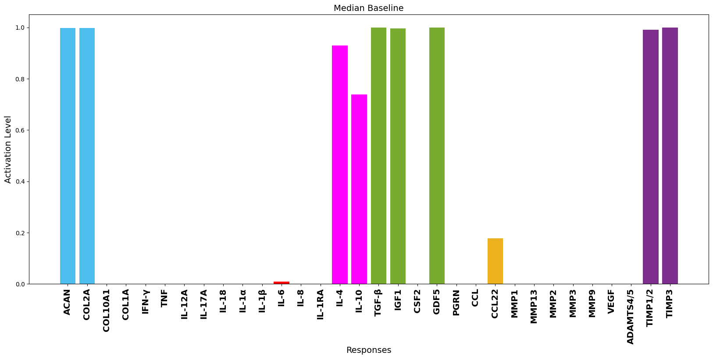
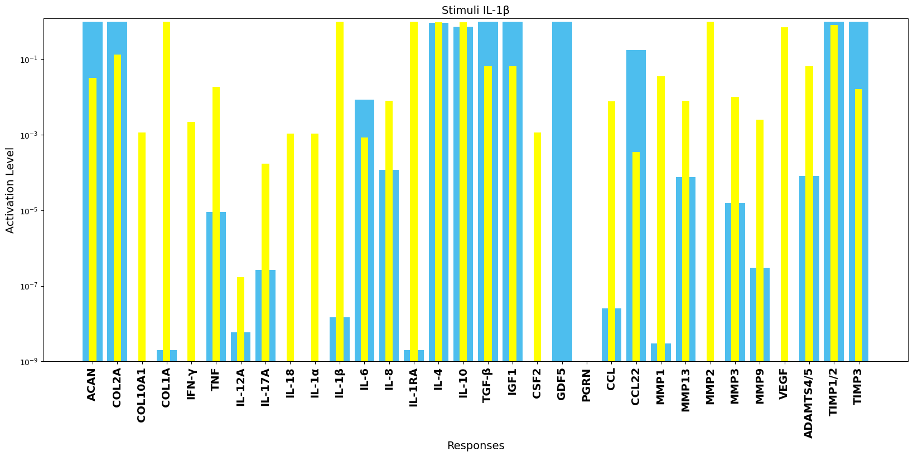

# Nucleus Pulposus Cell Network Modelling in the Intervertebral Disc
## Abstract
Intervertebral disc degeneration (IDD) arises from an intricate imbalance between the anabolic and catabolic processes governing the extracellular matrix (ECM) within the disc. Biochemical processes are complex, redundant and feedback-looped, and improved integration of knowledge is needed. To addess this, a literature-based regulatory network model (RNM) for nucleus pulposus cells (NPC) is proposed, representing the normal state of the intervertebral disc (IVD), in which proteins are represented by nodes that interact among each other through activation and/or inhibition edges. This model includes 32 different proteins and 150 edges by incorporating critical biochemical interactions in IVD regulation, tested in vivo or vitro in humans’ and animals’ NPC, alongside non tissue specific protein-protein interactions. We used the network to calculate the dynamic regulation of each node  through a semi-quantitative method. The basal steady state successfully represented the activity of a normal NPC, and the model was assessed through the published literature, by replicating two independent experimental studies in human normal NPC. Pro-catabolic or pro-anabolic shifts of the network activated by nodal perturbations could be predicted. Sensitivity analysis underscores the significant influence of transforming growth factor beta (TGF-β) and interleukin-1 receptor antagonist (IL-1Ra) on the regulation of structural proteins and degrading enzymes within the system. Given the ongoing challenge of elucidating the mechanisms driving ECM degradation in IDD, this unique IVD RNM holds promise as a tool for exploring and predicting IDD progression, shedding light on IVD phenotypes and guiding experimental research efforts

## Mendoza Equation
The Mendoza equation is a mathematical model used to describe the dynamics of nodes in a network. It is implemented in Python and uses ordinary differential equations (ODEs) to compute the behavior of each node over time based on activation and inhibition interactions among them. 

### Differential Equation
The differential equation for the Mendoza model is defined as follows:

```python
def ODESysFun(t, X, NumOfNodes, Mact, Minh, Clamped):
    gamma = np.ones(NumOfNodes)  # Decay constant of each node
    h = 10  # Steepness of activation
    f = np.zeros(NumOfNodes)

    for i in range(NumOfNodes):
        Ract = Mact[i, :]
        Rinh = Minh[i, :]
        sum_alpha_X = np.dot(Ract, X)
        sum_beta_X = np.dot(Rinh, X)
        sum_alpha = np.sum(Ract)
        sum_beta = np.sum(Rinh)

        if np.any(Rinh == 0) and np.any(Ract):
            w = ((1 + sum_alpha) / sum_alpha) * (sum_alpha_X / (1 + sum_alpha_X))
        elif np.any(Ract == 0) and np.any(Rinh):
            w = 1 - ((1 + sum_beta) / sum_beta) * (sum_beta_X / (1 + sum_beta_X))
        elif np.any(Ract) and np.any(Rinh):
            w = (((1 + sum_alpha) / sum_alpha) * (sum_alpha_X / (1 + sum_alpha_X))) * (1 - ((1 + sum_beta) / sum_beta) * (sum_beta_X / (1 + sum_beta_X)))
        else:
            w = 0

        f[i] = (-np.exp(0.5 * h) + np.exp(-h * (w - 0.5))) / ((1 - np.exp(0.5 * h)) * (1 + np.exp(-h * (w - 0.5)))) - gamma[i] * X[i]
        
        if Clamped[i] == 1:
            f[i] = 0

    return f
```

## Scripts Description

### `diffsolvemendoza.py`
This script contains the implementation of the Mendoza equation for the simulation of the network dynamics.

### `sbmlgenerator.py`
Generates an SBML (Systems Biology Markup Language) model from the network data. This model can then be used in various bioinformatics tools to further analyze the network dynamics.

### `run.py.py`
Runs the simulation based on the SBML model

## Data Files

### `SMENR1.xlsx`
Contains the data defining nodes, activators, and inhibitors for the network, which are used as input for the simulations.

## Visualizations


### `Median Baseline`
#

### `Sstimuli_IL-1β`

