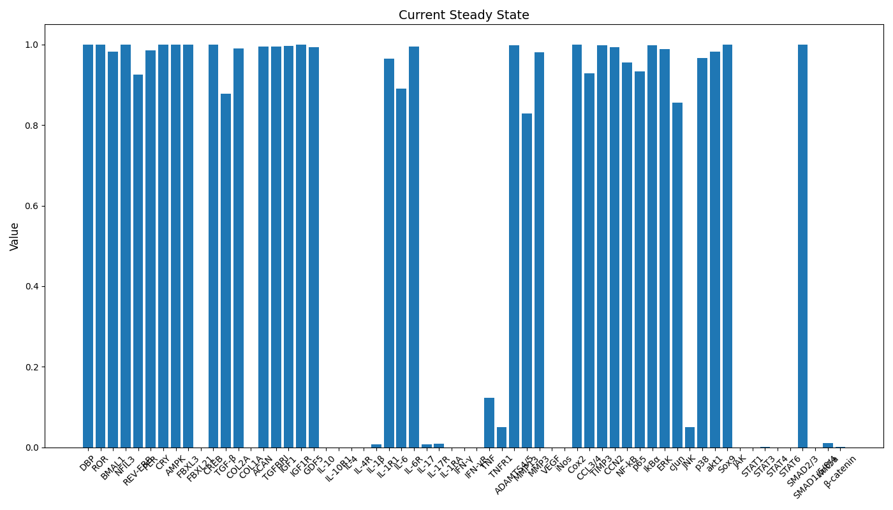

# Mendoza Project

## Overview
The Mendoza project involves simulating a network of biochemical reactions using the Mendoza equation to study the dynamics of a system of nodes under various activation and inhibition conditions. This repository contains scripts for simulation, SBML model generation, and associated data files necessary for running these simulations.

## Mendoza Equation
The Mendoza equation is a mathematical model used to describe the dynamics of nodes in a network. It is implemented in Python and uses ordinary differential equations (ODEs) to compute the behavior of each node over time based on activation and inhibition interactions among them. 

### Differential Equation
The differential equation for the Mendoza model is defined as follows:

```python
def ODESysFun(t, X, NumOfNodes, Mact, Minh, Clamped):
    gamma = np.ones(NumOfNodes)  # Decay constant of each node
    h = 10  # Steepness of activation
    f = np.zeros(NumOfNodes)

    for i in range(NumOfNodes):
        Ract = Mact[i, :]
        Rinh = Minh[i, :]
        sum_alpha_X = np.dot(Ract, X)
        sum_beta_X = np.dot(Rinh, X)
        sum_alpha = np.sum(Ract)
        sum_beta = np.sum(Rinh)

        if np.any(Rinh == 0) and np.any(Ract):
            w = ((1 + sum_alpha) / sum_alpha) * (sum_alpha_X / (1 + sum_alpha_X))
        elif np.any(Ract == 0) and np.any(Rinh):
            w = 1 - ((1 + sum_beta) / sum_beta) * (sum_beta_X / (1 + sum_beta_X))
        elif np.any(Ract) and np.any(Rinh):
            w = (((1 + sum_alpha) / sum_alpha) * (sum_alpha_X / (1 + sum_alpha_X))) * (1 - ((1 + sum_beta) / sum_beta) * (sum_beta_X / (1 + sum_beta_X)))
        else:
            w = 0

        f[i] = (-np.exp(0.5 * h) + np.exp(-h * (w - 0.5))) / ((1 - np.exp(0.5 * h)) * (1 + np.exp(-h * (w - 0.5)))) - gamma[i] * X[i]
        
        if Clamped[i] == 1:
            f[i] = 0

    return f
```

## Scripts Description

### `diffsolvemendoza.py`
This script contains the implementation of the Mendoza equation for the simulation of the network dynamics.

### `sbmlgenerator2.py`
Generates an SBML (Systems Biology Markup Language) model from the network data. This model can then be used in various bioinformatics tools to further analyze the network dynamics.

### `annotate.py`
Adds annotations to the generated SBML model, enriching it with metadata for better understanding and integration with other data sources.

## Data Files

### `CRT.xlsx`
Contains the data defining nodes, activators, and inhibitors for the network, which are used as input for the simulations.

### `annotations.xlsx`
Contains annotations that are added to the SBML model to provide context and metadata about the model components and their interactions.

## Visualizations

### `reaction graph`

This image shows the reaction graph generated by `sbmlgenerator2.py`, visualizing the interactions among different nodes within the model.
### `Plots`

### `Steady States`
